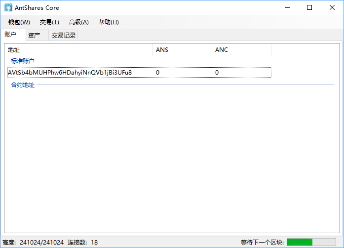
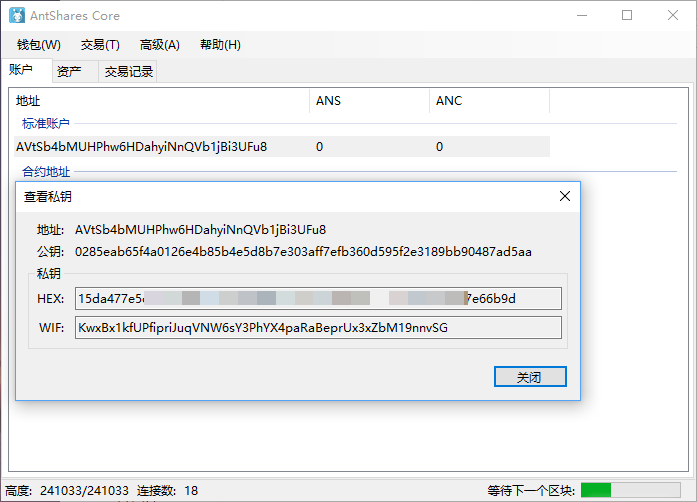
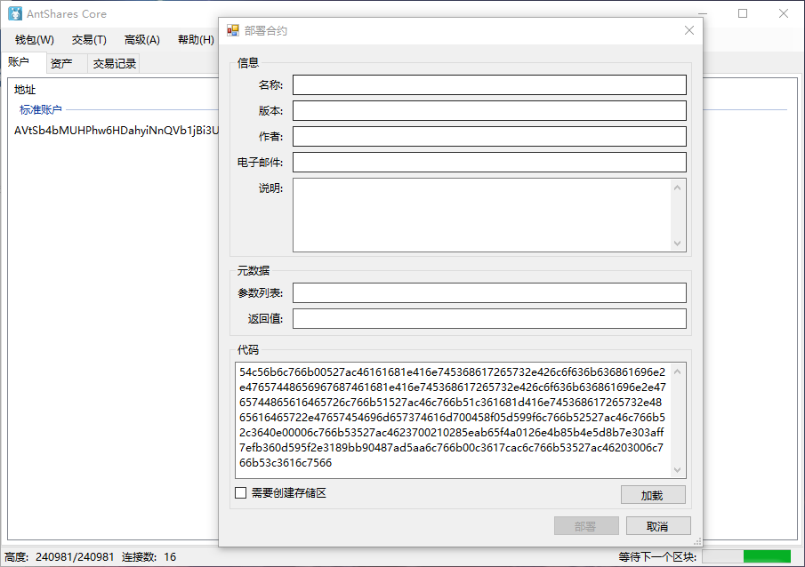
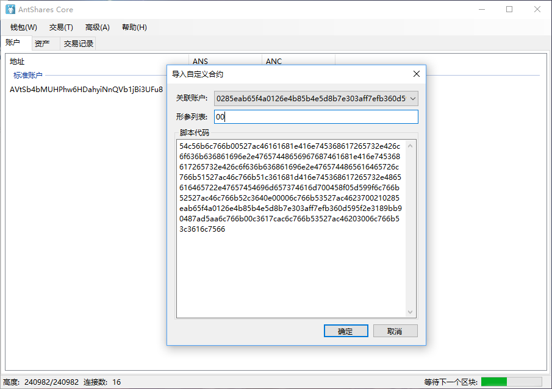
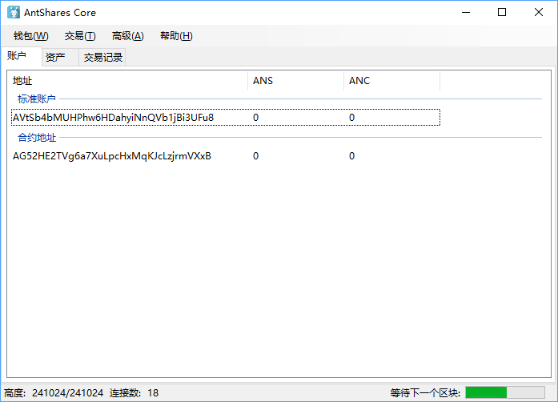
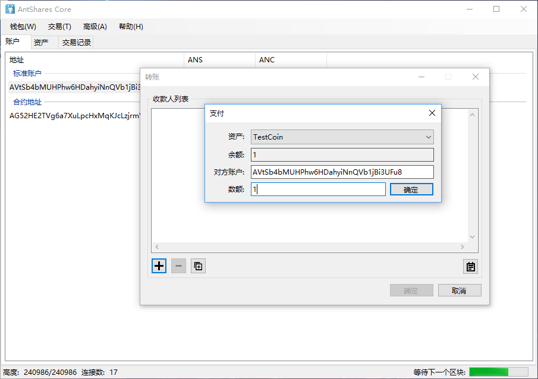

# 锁仓合约的部署

阅读本文前先要阅读有以下教程：

[如何用 C# 编写 NEO 智能合约](../getting-started-csharp.md)

[NEO 智能合约教程](../tutorial.md)

[智能合约示例——Lock（锁仓合约）](Lock.md)

现在我们假设你已经有了智能合约的基础知识，下面我们来实践下如何在钱包中部署一个锁仓的智能合约地址。

另外本教程是基于智能合约 2.0 的演示，请从 [GitHub](https://github.com/neo-project/neo-gui/releases) 中下载最新的客户端运行。

附：截止到文档编写时，最新的客户端下载地址：[Neo GUI v2.2.0](https://github.com/neo-project/neo-gui/releases)。

## 创建钱包

这步很基础，打开 PC 版客户端，点击 ` 钱包 `，` 创建钱包数据库 `，然后选择钱包存储位置，设置钱包名称和密码。



## 获得公钥

新创建的钱包会自动生成一个标准账户，` 右击 ` 该账户，` 查看私钥 `，复制第二行的公钥，如图所示：



> [!Caution]
> 截图时注意不要泄露私钥，记得打码哦。

下面我们写一个本地程序，把公钥转成字节数组，C# 代码如下：

```c#
namespace ConsoleApp1
{
    class Program
    {
        static void Main(string[] args)
        {
            // 这里替换为上一步复制的公钥
            byte[] b = HexToBytes("0285eab65f4a0126e4b85b4e5d8b7e303aff7efb360d595f2e3189bb90487ad5aa"); 
            foreach (var item in b)
            {
                Console.Write($"{item}, ");
            }
            Console.ReadLine();
        }

        static byte[] HexToBytes(string hexString)
        {
            hexString = hexString.Trim();
            byte[] returnBytes = new byte[hexString.Length / 2];
            for (int i = 0; i < returnBytes.Length; i++)
            {
                returnBytes[i] = Convert.ToByte(hexString.Substring(i * 2, 2), 16);
            }
            return returnBytes;
        }
    }
}
```

运行后，会在屏幕中输出公钥的 byte 数组，将其复制下来，下一步会用到。

## 编写智能合约

创建智能合约项目，编写如下的智能合约。注意，这里的合约是继承自 VerificationCode，它的用途是生成合约鉴权账户，即钱包文件中的一个合约地址。

```c#
using Neo.SmartContract.Framework;
using Neo.SmartContract.Framework.Services.Neo;

namespace Neo.SmartContract
{
    public class Lock : VerificationCode
    {
        public static bool Verify(byte[] signature)
        {
            Header header = Blockchain.GetHeader(Blockchain.GetHeight());
            if (header.Timestamp < 1499328600) // 2017-6-6 18:10
                return false;
            // 这里粘贴上一步复制的公钥字节数组
            return VerifySignature(new byte[] { 2, 133, 234, 182, 95, 74, 1, 38, 228, 184, 91, 78, 93, 139, 126, 48, 58, 255, 126, 251, 54, 13, 89, 95, 46, 49, 137, 187, 144, 72, 122, 213, 170 }, signature);
        }
    }
}
```

锁仓合约有两个重要的地方要更改，一是公钥，二是锁仓时间。

1、在合约代码中粘贴上一步复制的公钥字节数组

2、更改示例代码中的锁仓时间，该时间为 Unix 时间戳。此时间戳自己写代码计算出来，也可以直接在网上查询，[Unix 时间戳在线转换](https://unixtime.51240.com/)。

替换好以上两个地方后编译该合约，此时会生成一个 Lock.avm 文件。

## 部署锁仓合约

部署锁仓合约首先要获取到上一步生成的 Lock.avm 的合约脚本，获取合约脚本的方法有很多种，可以直接通过如下的 C# 代码读取 .avm 文件获取二进制代码。

```c#
byte[] bytes = System.IO.File.ReadAllBytes("Test.avm");
string str = System.Text.Encoding.Default.GetString(bytes);
```

如果觉得写代码获取合约脚本比较麻烦，客户端的 ` 部署合约 ` 中提供了简单的获取合约代码的方法：

点击 ` 高级 `，` 部署合约 `，点击右下角的 ` 加载 ` 按钮，选择上一步生成的 Lock.avm 文件。，在 ` 代码 ` 框中就看到了合约的脚本了，如图。将其复制下来下一步会用到。



在客户端 ` 账户 ` 选项卡的空白处点击鼠标 ` 右键 `，` 创建智能合约 `，` 自定义 `，用上一步的合约脚本创建合约地址：




这里要选择一个关联账户（准确来说应该是关联一对公私钥），关联的意思就是，如果该智能合约需要签名操作，客户端将用哪个私钥进行签名。这步要选择和第一步一样的公钥，否则在执行智能合约时签名不匹配，执行失败。因为我们的合约中有一个签名的参数，所以在 ` 形参列表 ` 中要填写 00 （关于参数填写可以参考 [此文](Parameter.md)。），并在 ` 脚本代码 ` 中填写上一步复制的合约脚本代码。如图所示，是创建好合约地址。




## 测试

下面是对智能合约鉴权账户的测试，当从一个智能合约鉴权账户转出资产时，共识节点在验证交易时会执行该智能合约。如果合约验证成功（返回结果为 true），则交易确定。否则这笔交易一直会未确认。测试方法就是先向合约鉴权账户转入一笔资产，再将其转出。

> [!Note]
> 为了保证测试的准确性，钱包中最好不要有其余的资产，否则你可能不知道资产是从标准账户转出还是从合约账户转出，除非你理解客户端的零钱查找算法，知道该笔交易输入是从智能合约地址转出。

### 转入资产到合约地址

打开一个有 ** 测试网 ** 资产的钱包，转一定数量的资产到你的合约账户。

### 转出合约资产

从你的智能合约账户中转出资产：



如果你以上操作正确，转出资产时会发生以下情况：

在当前时间小于锁仓时间时，转账将会未确认，即转账失败。

这时 ` 重建钱包索引 ` 后，过大约 5 分钟后，未确认的转账会消失，资产恢复到之前的状态。

在当前时间大于锁仓时间时，转账会成功。
